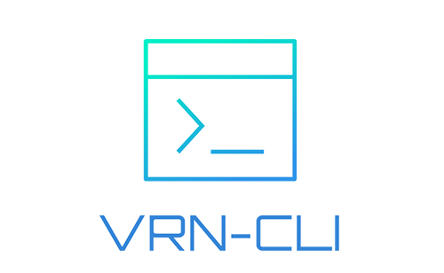

<div align="center">

<a href="https://github.com/vrn-deco/cli">

</a>


[](https://codecov.io/gh/vrn-deco/cli)
[](https://www.npmjs.com/package/@vrn-deco/cli)

[](http://commitizen.github.io/cz-cli/)
[](https://pnpm.io/)

[简体中文](./README_zh.md)

</div>

`@vrn-deco/cli` is an automated command line tool whose core feature is to help you quickly build an engineered project via `boilerplate`. It supports multiple creation modes, you can get `boilerplate` from the sources we provide, or you can specify a third party or your own source.

> ⚠️ Please make sure your **Node.js version >=18.0.0**

## Quick Start

If you are using it for the first time, we recommend `npm create` to quickly create it without installing the CLI globally


```sh
# npm
npm create vrn@latest
# yarn
yarn create vrn
# pnpm
pnpm create vrn
```

Then follow the prompts, you can create a project with the preset `boilerplate-package`!

### Install CLI

If you need to use it frequently, or plan to learn the follow-up advanced guide, then please install `@vrn-deco/cli` globally

```sh
# npm
npm install -g @vrn-deco/cli
# yarn
yarn add --global @vrn-deco/cli
# pnpm
pnpm install -g @vrn-deco/cli
```

Let's create another project, this time by executing `vrn create` command

```sh
vrn create my-app
```

Follow the prompts to complete the project creation

> Since the dependencies of services other than the ontology are dynamically managed, checks and incremental installations are performed during use

## Advanced Guide

Here is the advanced content, you will know the following:

- Global configuration `vrn config` command
  - Turn on or off update check
  - Toggle NPM registry
  - Toggle package manager
- Boilerplate service `vrn boi` command
  - Package Mode creation
    - Interactive and non-interactive
    - Custom `manifest-package`
  - HTTP Mode creation
    - Interactive and non-interactive
    - Custom `api-url`
  - Git Mode creation
    - `post-git` Post-processing
  - List of available packages

### Config Command

`config` is the command used to manage the global configuration of the CLI, which is entered into interactive mode with the following command:

```sh
# Interactively view configuration items or modify them
vrn config
```

The CLI will show all the configurations that can be changed and their current values in a list, and you can modify it by selecting one of the configurations

#### Update Check

`checkUpdateEnabled`: `boolean` (default: `true`)

Execute update check before command scheduling. If there is a new version, a tip log will be output in the terminal, which will not affect subsequent program execution. **The default check period is 1 day**

You can set `checkUpdateEnabled: false` to disable update check

#### NPM registry

`npmRegistry`: `string` (default: `'https://registry.npmmirror.com'`)

The CLI used npm registry, from which version update checks and subsequent incremental dependency installations are fetched

Provide two preset values:

- `NPM`: `https://registry.npmjs.org`
- `TAOBAO`: `https://registry.npmmirror.com`

Since it is difficult for Chinese users to access `NPM` registry, the default is `TAOBAO` registry, you can change it to `NPM` registry or custom registry (ensure accessibility by yourself)

> It is important to note that this item only affects the npm registry used by the CLI and does not modify the global config of npm

#### Package manager

`packageManager`: `'npm' | 'yarn' | 'pnpm'` (default: `'npm'`)

The CLI used package manager, subsequent incremental dependencies will be operated using the specified package manager

Support three mainstream package managers: `npm`, `yarn`, `pnpm`, you can specify it as your usual package manager (except `npm`, you need to install it globally)

> Due to the different dependency directory structures and generated lock files installed by different package managers, do not switch this configuration frequently

### Boilerplate Command

This command provides `boilerplate` related services whose implementation follows the [@vrn-deco/boilerplate-protocol](https://github.com/vrn-deco/boilerplate/tree/main/protocol) specification. Since `boilrplate` is really long, we define a shorter alias `boi` for it, see the help with the `-h` option:

```sh
vrn boi -h
# Equivalent to
vrn boilerplate -h
```

The core feature is the `boi create` subcommand, which can also be viewed through the `-h` option:

```sh
vrn boi create -h
```

Maybe you remembered the example from the "Quick Start". yes, `create` is a shortened alias for `boi create`

```sh
vrn create my-app
# Equivalent to
vrn boi create my-app
```

The above command will perform an interactive build using `package` mode! What is `package` mode? Get to know it now!

#### Creation Mode

According to the [@vrn-deco/boilerplate-protocol](https://github.com/vrn-deco/boilerplate/tree/main/protocol) specification, we provide the creation of the `package` mode, additionally two modes : `http` and `git`

Modes mean how `boilerplate` is provided. Here are the characteristics of the three modes:

- `package`: Provide boilerplate through npm package, which we call `boi-package`
  - Publish all available `boi-package` via a `manifest-package`
  - `manifest-package` and `boi-package` are dynamic dependencies and are incrementally installed
  - `boilerplate` itself is stored in `boi-package`
  - `boi-package` is responsible for describing and installing its own `boilerplate`
  - Support custom script hooks, more flexible and powerful
- `http`：Pack and compress the `boilerplate` (usually `.tgz`), we call it `packed-boi`, and distribute it through the Server interface or CDN
  - Describe all available `packed-boi` via an interface or `manifest.json` file
  - Unpack installation by CLI, only support specific compression formats
  - Fastest, but doesn't support extra operations on the inside of `boilerplate`
- `git`：`git clone` an existing repository
  - Supports arbitrary origin and post-processing

#### Package Mode creation

`package` mode supports interactive and non-interactive creation

##### Interactive creation

The CLI will ask for various required parameters and show you all available `boi-package`, choose one to complete the creation

```sh
# By default, you only need to pass in one parameter <folder_name>
vrn boi create my-app

# If you are in a Monorepo, you can pass in the second parameter [base_directory]
vrn boi create my-app ./packages
```

By default all optional `boi-package` are provided through `@vrn-deco/boilerplate-manifest` package, if you want to use your own `manifest-package` to provide `boi-package`, you can use `- -manifest-package` option specified

```sh
# Get `boi-package` available via @your-scope/your-manifest-package
vrn boi create my-app --manifest-package @your-scope/your-manifest-package
```

##### Non-interactive creation

Maybe you want to create via script, or make the "create" part of an automated task, then you should use a non-interactive create, it will directly complete the creation or fail

> The command can be called in a shell script or Node.js child_process

```sh
vrn boi create my-app --yes \
   --name=my-app --version=1.0.0 --author=cphayim \
   --target @vrn-deco/boilerplate-javascript-vue # For example only, the package may not exist
```

These options are all required:

- `--yes`：Non-interactive
- `--name`: Project name
- `--version`：Version
- `--author`：Author
- `--target, --target-boilerplate`：Specify `boi-package`
  - Must be full package name
  - Must conform to the definition of `boi-package` in [@vrn-deco/boilerplate-protocol](https://github.com/vrn-deco/boilerplate/tree/main/protocol#boilerplate-packages)
  - Does not verify that `target` is in `manifest`

Node.js call example:

```js
await execaCommand(
  `
  vrn create ${PROJECT_NAME} --yes \
    --name=${PROJECT_NAME} --version=${PROJECT_VERSION} \
    --author=${execaCommandSync('git config --global user.name').stdout}
    --target @vrn-deco/boilerplate-typescript-vue3-varlet-h5plus
`,
  {
    stdio: 'inherit',
    cwd: process.cwd(),
  },
)
```

#### HTTP Mode creation

> The `http` mode exists to complement specific scenarios, we still recommend that you use the `package` mode.

`http` mode also support interactive and non-interactive creation

##### Interactive creation

```sh
# You need to pass `--mode=http` to enable it, as 'package' mode is default
vrn boi create my-app --mode=http

# If you are in a Monorepo, you can pass in the second parameter [base_directory]
vrn boi create my-app ./packages --mode=http
```

By default all optional `packed-boi` are provided through `https://vrndeco.cn/boilerplate`, if you want to use your own interface to provide `packed-boi`, you can use `--api-url` ` option specifies the BaseURL of the request

```sh
vrn boi create my-app --mode=http --api-url=https://yoursite.com/boilerplate
```

##### Non-interactive creation

```sh
vrn boi create my-app --mode=http --yes \
  --name=my-app --version=1.0.0 --author=cphayim \
  --target boilerplate-typescript-vue3-varlet.tgz
# There is no `--api-url` passed here, take the default value,
# it will download https://vrndeco.cn/boilerplate/boilerplate-typescript-vue3-varlet.tgz

vrn boi create my-app --mode=http --yes \
  --name=my-app --version=1.0.0 --author=cphayim \
  --target https://yoursite.com/boilerplate/boilerplate-typescript-vue3-varlet.tgz

# Equivalent to
vrn boi create myapp --mode=http --yes \
  --name=myapp --version=1.0.0 --author=cphayim \
  --api-url= https://yoursite.com/boilerplate \
  --target boilerplate-typescript-vue3-varlet.tgz
```

Except for the value of the `target` option, it is the same as the `package` mode:

- `--target, --target-boilerplate`: Specify the `packed-boi` filename
  - Can be a filename or a full URL path
  - Does not verify that `target` is in the `manifest` returned by the interface

#### Git Mode creation

> Do not use git mode in Monorepo!

`git` mode is created by `clone` a repository to the local

```sh
# You need to pass `--mode=git` to enable it, as 'package' mode is default
# `--target` is repository url, support `HTTPS` and `SSH`
vrn boi create my-app --mode=git --target=https://github.com/vrn-deco/xxx.git
vrn boi create my-app --mode=git --target=git@github.com:vrn-deco/xxx.git
```

You can also use `--post-git` to tell the CLI what to do with the original commit after cloning

- `--post-git`: (default: `'retain'`)
  - `retain`: Keep the original record
  - `remove`: Remove the local repository
  - `rebuild`: Rebuild the local repository

```sh
# keep origin record
vrn boi create my-app --mode=git --post-git=retain --target=git@github.com:vrn-deco/xxx.git
# rm -rf .git
vrn boi create my-app --mode=git --post-git=remove --target=git@github.com:vrn-deco/xxx.git
# rm -rf .git && git init && git add . && git commit -m "chore: init repository"
vrn boi create my-app --mode=git --post-git=rebuild --target=git@github.com:vrn-deco/xxx.git
```

#### List

Use the `boi list` command to list all available `boi-package`, alias `boi ls`:

```sh
vrn boi ls
vrn boi ls --json # output json
vrn boi ls --json --out-file ./boilerplate.json # output json and write file
vrn boi ls --yaml	# output yaml
vrn boi ls --yaml --out-file ./boilerplate.yaml # output yaml and write file

# List all `boi-package` in @your-scope/your-manifest-package
vrn boi ls --manifest-package @your-scope/your-manifest-package
```

> Note that the `list` command can only list the packages available in `package` mode, it does not support `http` and `git` modes

## Migration from v0.x

You or your team may be using the `v0.x` version and have deployed the corresponding `boilerplate` interface

If you want to migrate to `v1.x` or keep the `v0.x` version, see [Migration Guide](./docs/migration.md)

## Changelogs

[CHANGELOG.md](./CHANGELOG.md)

## License

[MIT](./LICENSE)
