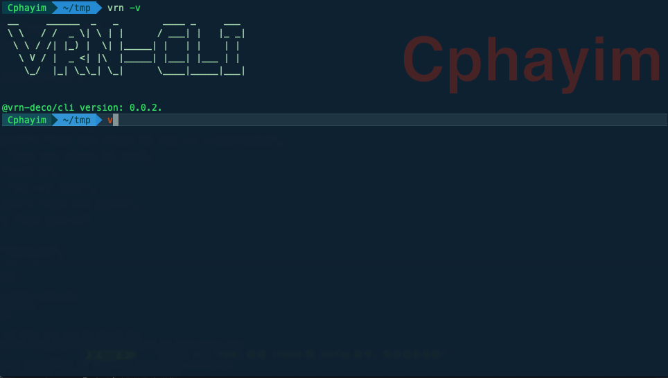

# @vrn-deco/cli

⚙️ Project scaffolding with command line tools. 🛠

[](http://commitizen.github.io/cz-cli/)
 

## Install

```sh
$ npm install -g @vrn-deco/cli
```

## Usage

```
# Set your boilerplate registry service address.
$ vrn config set registry xxx

# Create project.
$ vrn create my-app
```


